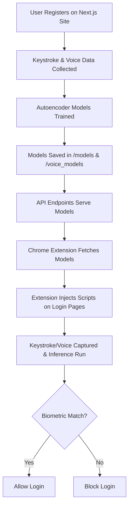

# GhostKey Biometric Authentication

GhostKey is a multi-modal biometric authentication system that combines keystroke dynamics and voice recognition to provide secure, user-specific login protection for any website. It consists of a Next.js backend for model training and a Chrome extension that enforces biometric authentication on login forms across the web.

---

## 🚀 Features
- **Keystroke Dynamics**: Learns your unique typing rhythm using autoencoder models.
- **Voice Biometrics**: Optionally uses your voice as a second authentication factor.
- **Universal Web Protection**: Chrome extension blocks logins unless your biometrics match, even if someone knows your password.
- **Local Model Storage**: Models are stored and served securely from your backend.
- **Easy Model Sync**: Extension fetches the latest models after registration or retraining.
- **Privacy-First**: All biometric data and models are user-specific and never shared with third parties.

---

## 🏗️ Architecture



---

## 🛠️ Setup Instructions

### 1. Backend (Next.js)

1. **Install dependencies:**
   ```bash
   npm install
   ```
2. **Start the server:**
   ```bash
   npm run dev
   ```
3. **Register a user:**
   - Visit the web UI and register by providing keystroke and (optionally) voice samples.
   - **Note:** The model files (`/models/yas/model.json` and `/voice_models/yas/model.json`) are **created automatically** after the first successful registration. They are not present by default.
4. **Serve models via API:**
   - Endpoints:
     - `/api/get-keystroke-model` (serves keystroke model)
     - `/api/get-voice-model` (serves voice model)
   - Ensure these endpoints are protected in production.

### 2. Chrome Extension

1. **Build/prepare extension files:**
   - Ensure `manifest.json`, `background.js`, `content.js`, `popup.js`, and `popup.html` are present in the root directory.
2. **Load the extension in Chrome:**
   - Go to `chrome://extensions/`
   - Enable **Developer mode**
   - Click **Load unpacked** and select the project folder (should contain `manifest.json`)
3. **Sync models:**
   - Open the extension popup and click **Sync Biometric Models** to fetch the latest models from the backend.
   - **Note:** You must complete registration on the web UI first, so the models exist for the extension to fetch.

---

## 🧑‍💻 Usage

- **Registration:**
  - Register on the Next.js site, providing keystroke and (optionally) voice samples.
  - Models are trained and stored on the backend **after registration**.
- **Authentication:**
  - On any login page, the extension captures your keystrokes (and voice if enabled).
  - The extension runs inference using the latest models.
  - If your biometrics match, login proceeds. If not, login is blocked.

---

## 🔐 How Authentication Works

After registration and model creation, authentication is enforced as follows:

1. **Model Fetch:**
   - The Chrome extension fetches your trained keystroke and voice models from the backend using the provided API endpoints.
   - Models are cached locally in the extension for fast access.
2. **Biometric Capture:**
   - When you visit any login page, the extension’s content script automatically captures your keystroke patterns as you type.
   - If voice authentication is enabled or required (e.g., after failed attempts), the extension prompts you to provide a short voice sample.
3. **Inference:**
   - The extension loads your models using TensorFlow.js and extracts features from your current keystroke and/or voice input.
   - It runs inference to compare your current input to your registered biometric profile, calculating a reconstruction error or similarity score.
4. **Decision:**
   - If the biometric match is within the allowed threshold, the extension allows the login form to submit as normal.
   - If the match fails, the extension blocks the login attempt (e.g., prevents form submission or shows an error message).
   - After repeated failures, the extension may require voice authentication as a fallback (if enabled).

This process ensures that only the genuine user—whose biometrics match the registered profile—can log in, even if someone else knows the password.

---

## 🧠 Model Training & Inference
- **Keystroke Model:**
  - Autoencoder trained on your typing patterns.
  - Used to compute reconstruction error for authentication.
- **Voice Model:**
  - Trained on your voice samples (optional, for higher security).
- **Inference:**
  - Models are loaded in-browser using TensorFlow.js.
  - Feature extraction and inference are performed client-side for privacy.

---

## 🔒 Security Notes
- **Model API endpoints should be protected** (e.g., with authentication) in production.
- **Biometric data is never shared** with third parties.
- **All inference is performed locally** in the browser for maximum privacy.

---

## 🛠️ Troubleshooting
- **Manifest file is missing or unreadable:**
  - Ensure you are loading the extension from the correct folder containing `manifest.json`.
- **Node.js module errors in API routes:**
  - Make sure `export const runtime = 'nodejs';` is set in your API route files.
  - Install Node.js types: `npm install --save-dev @types/node`
- **Model not found errors:**
  - **You must register a user first!** The model files are created after registration. If you see a model not found error, complete registration on the web UI.
- **Extension not blocking login:**
  - Make sure the content script is running and models are synced.

---

## 📂 Project Structure

```
the most final/
├── app/
│   └── api/
│       ├── get-keystroke-model/
│       │   └── route.ts
│       └── get-voice-model/
│           └── route.ts
├── background.js
├── content.js
├── popup.js
├── popup.html
├── manifest.json
├── models/
│   └── yas/model.json   # <-- Created after registration
├── voice_models/
│   └── yas/model.json   # <-- Created after registration
...
```

---

## 🤝 Contributing
Pull requests and suggestions are welcome! Please open an issue for major changes.

---

## 📜 License
MIT
